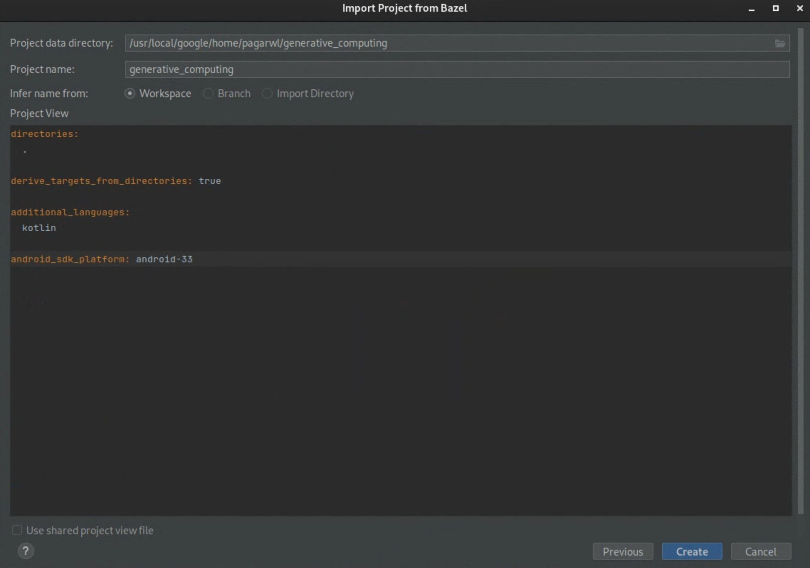

# GenC on Android

This guide covers steps to build and install GenC's example app on Android.

## 1. Clone git repository
First let's download GenC codebase if not done already. We will
assume this gets downloaded to ```generative_computing``` directory locally and
will be referred to as the project directory in the following steps.

```
git clone https://github.com/google/generative_computing
```

## 2. Build and Deploy GenC Android demo app with Bazel

There are two ways to build GenC Android demo app, one using Docker container
and another building directly from local source code without a Docker container.
We recommend building and deploying the app using the Docker container as most
prerequisite dependencies are auto-installed for you in that environment.

Building from local source code is useful if you are using Android Studio
for development (see instructions below on setting up GenC with Android Studio).

Below are the instructions for both the methods:

### 2.1 Build GenC Android app with Docker Container

#### Build Docker container
```
cd generative_computing
docker build -t genc .
docker run -it -v $PWD:/generative_computing genc:latest /bin/bash -c "cd generative_computing; bash ./setup_android_build_env.sh; /bin/bash"
```

Please note that running above automatically installs all the needed
prerequisites such as Java runtime, Bazel, and runs
[setup_android_build_env.sh](setup_android_build_env.sh) to download
Android SDK and NDK in the Docker container.

It additionally sets up the environment variables
($ANDROID_HOME, $ANDROID_NDK_HOME) and adds needed rules
(android_ndk_repository() and android_sdk_repository()) in the
[WORKSPACE](WORKSPACE) file.

Note: There will be a (y/N) prompt to accept Android SDK, NDK license as part
of docker run, please accept the license. Check if you have successfully built
docker container. Check the active images by running "docker images".

#### Build and run the demo app

Now, you can build the APK directly from the root directory
(```/generative_computing``` as used above).

```
bazel build --config=android_arm64 generative_computing/java/src/java/org/generativecomputing/examples/apps/gencdemo:app
```

Once built, the APK will be in the `bazel-bin` folder. This will need to be
copied to the folder that is shared between the Docker container and the host
machine (because Docker doesn't have access to your USB devices). This folder is
```/generative_computing``` (per setup steps above).

```
cp bazel-bin/generative_computing/java/src/java/org/generativecomputing/examples/apps/gencdemo/app.apk /generative_computing

// See [Tutorial 1](tutorials/tutorial_1_simple_cascade.ipynb)
// to generate the IR at ```/tmp/genc_demo.pb```. Copy the IR generated in
// Tutorial 1 to run first demo.
cp /tmp/genc_demo.pb /generative_computing
```

In a different terminal outside of the Docker container, you can now ADB
install the APK and push the IR to device.

```
adb install app.apk
adb push genc_demo.pb /data/local/tmp/genc_demo.pb
```

Open "GenC Demo app" on the Android phone. Enter appropriate
text input for the IR used. In these steps, we used Tutorial 1, which has
prompt template as "Tell me about {topic}". So, enter any topic in the text
field, e.g. "scuba diving". See response.

### 2.2 Build GenC Android app without Docker Container

#### Install Prerequisites

##### Java Runtime

Ensure that Java runtime is installed on the machine. If not, please install
it.

##### Install Bazel

Please run following command to install Bazel:

```
sudo apt update && sudo apt install bazel-6.3.2
```

##### Setup Android SDK, Android NDK version 21

Android SDK and NDK are needed dependencies to build and run GenC. We need to
install Android SDK release 30.0.0 and above, and Android NDK version 21. There
are two options to download and setup these, we recommend Option 1 for ease of
installation and setup:

##### Option 1: Run [setup_android_build_env.sh](setup_android_build_env.sh)
For ease of setup, you can run [setup_android_build_env.sh](setup_android_build_env.sh)
to download and setup Android SDK and NDK before building GenC Android demo app.
Run following command from the project directory where GitHub code was
downloaded in step 1 above.

Note that this automatically sets up the environment
variables $ANDROID_HOME, $ANDROID_NDK_HOME and adds android_ndk_repository() and
android_sdk_repository() rules into the [WORKSPACE](WORKSPACE) file.

```
bash ./setup_android_build_env.sh
```

##### Option 2: Set up Android SDK and NDK via Android Studio
You can set up Android SDK and NDK via Android Studio. See instructions on the
Android Studio website to enable these. Please note that the Android SDK version
needs to be 30.0.0 or higher and Android NDK version needs to be 21.

If Android SDK and NDK are already installed (e.g., by Android Studio or were
pre-installed), follow these instructions to set the environment variables
and updates to [WORKSPACE](WORKSPACE) file:

Step 1: Set $ANDROID_HOME and $ANDROID_NDK_HOME to point to the installed SDK
and NDK.

```
export ANDROID_HOME=<path to the Android SDK>
export ANDROID_NDK_HOME=<path to the Android NDK>
```

Step 2: Add android_ndk_repository() and android_sdk_repository() rules into the
[WORKSPACE](WORKSPACE) file as the following:

```
echo "android_sdk_repository(name = \"androidsdk\")" >> WORKSPACE
echo "android_ndk_repository(name = \"androidndk\", api_level=30)" >> WORKSPACE
```

Note: By default, android_sdk_repository and android_ndk_repository will try to
find Android SDK and Android NDK on your machine by looking for $ANDROID_HOME
and $ANDROID_NDK_HOME environment variables. You may additionally specify
```path``` in android_ndk_repository() and android_sdk_repository() rules in
the ```WORKSPACE``` file if the paths don't get automatically inferred as
follows:

```
android_sdk_repository(name = "androidsdk", path = "/path/to/android/sdk")
android_ndk_repository(name = "androidndk", api_level=30, path = "/path/to/android/ndk/version")
```


#### Build and run the demo app

You can build the APK directly from the project directory
(```/generative_computing``` as used above).

```
bazel build -c opt --config=android_arm64 generative_computing/java/src/java/org/generativecomputing/examples/apps/gencdemo:app
```

Install the app on device:

```
adb install bazel-bin/generative_computing/java/src/java/org/generativecomputing/examples/apps/gencdemo/app.apk
```

Or build and install in one go:

```
bazel mobile-install -c opt --config=android_arm64 generative_computing/java/src/java/org/generativecomputing/examples/apps/gencdemo:app
```

## 3. Develop with Android Studio

For ease of development, build, install, and debug, this section covers how to
setup Android Studio with Bazel and load GenC demo app in it. Follow all the
steps in the following sections to set this up.

### Install Bazel plugin in Android Studio
GenC uses Bazel as the build system. As such, we need to install Bazel plugin in
Android Studio. To do so, follow these steps:

*   Click File > Settings from the menu bar
*   Click Plugins > Marketplace.
*   Type Bazel and install the official "Bazel for Android Studio" Bazel plugin
    from Google.


### Setup Build Dependencies

Run through the steps for installing all the prerequisites in the
[Build GenC Android app without Docker Container](android_setup.md)

### Use GenC's Bazel Workspace

In Bazel, a project is defined by the WORKSPACE file. GenC's
[WORKSPACE](WORKSPACE) file is located under the project root directory
```generative_computing```. To ensure everything is set up correctly so far,
from ```generative_computing``` directory, run:

```
bazel info workspace
```

If dependencies are set up correctly, you should see the path to the current
project directory printed as the output.

Note: Note that Android SDK and NDK rules got added to the ```WORKSPACE``` file in the
[Setup Build Dependencies](android_setup.md) section above. So, now the
```WORKSPACE``` file is ready to be loaded in Android Studio.

### Import GenC project in Android Studio

Next, we need to import GenC project in Android Studio, please follow these
steps:

1. Open Android Studio
2. Click File > Import Bazel Project…
3. Select path to the project root directory
4. Select Create from scratch

In the "Import Project From Bazel" pop-up, replace contents with the snippet
below. Feel free to edit the ```android_sdk_platform``` version to the Android
SDK version you have installed on your machine.

```
directories:
  .

derive_targets_from_directories: true

additional_languages:
  kotlin

android_sdk_platform: android-33
```



Note: This creates an ```.aswb``` directory under the project root directory and
a ```.bazelproject``` file (containing above configuration) is added under it.
You can further edit the configuration in ```.bazelproject``` as needed, the
current settings are sufficient for building and running the GenC demo app.

### Build and deploy GenC demo app using Android Studio

Now you can build the GenC demo app directly from Android Studio using the Bazel
plugin that we’ve installed in the earlier steps.

1. Before we build and deploy the GenC app, we need to configure the build / run
   configuration. Click on the "Edit Run / debug configurations dialog" in
   Android Studio. Click on "Edit Configurations".

   *   Set the target expression as: //generative_computing/java/src/java/org/generativecomputing/examples/apps/gencdemo:app
   *   Set Bazel command: mobile-install
   *   Set Bazel flags as:
          --fat_apk_cpu=arm64-v8a
          --cpu=arm64-v8a
          --config=android
   *   Click Apply, and OK.


2.  Connect an Android phone and ensure it shows up in the connected devices in
    Android Studio.

3.  Under the project files, navigate to GenC demo app ```android_binary``` rule
[generative_computing/java/src/java/org/generativecomputing/examples/apps/gencdemo/BUILD](../java/src/java/org/generativecomputing/examples/apps/gencdemo/BUILD). You will see a green arrow next to the
```android_binary``` target. You can click it now to build and install the GenC
demo app on the connected Android phone.

5.  You can also enable adb logcat to see GenC logs in Android Studio.

6.  If the build and install was successful, you will see
   “GenC demo app” installed on the phone.

7.  Now, you can deploy the IR on the phone (see [Tutorial 1](tutorials/tutorial_1_simple_cascade.ipynb))
   or create your own computations in the Java app.
